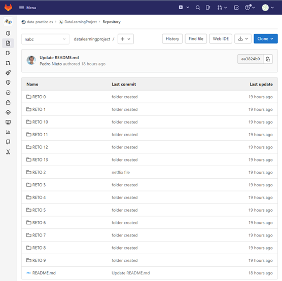
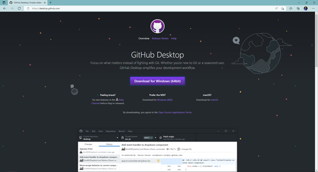
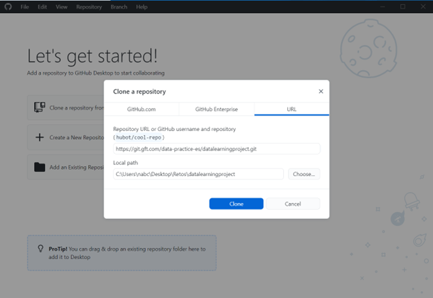
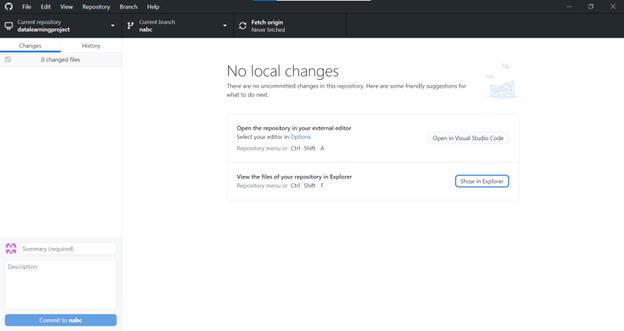

# RETO 0 - Crear Rama con tus 4 letras en GitLearning Project

## Crear rama "nabc" en el datalearningproject

El primer paso en este reto consistía simplemente en crear una nueva rama a partir de la main con el nombre de 4 letras "nabc". Esto mismo se puede realizar desde GitLab, y el resultado se puede ver en la captura de pantalla incluída a continuación.

## Clonado de datalearningproject en nuestro ordenador

El segundo y último paso era clonar localmente el repositorio.

Para ello, instalé GitHub Desktop y cloné el repositorio en una carpeta local copiando la URL HTTPS de GitLab.

Esto mismo se puede ver en las siguientes capturas, incluyendo una captura final que muestra la rama nabc en GitHub Desktop.

