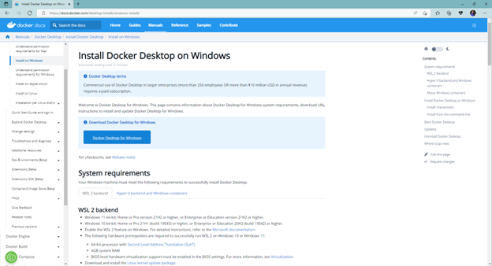
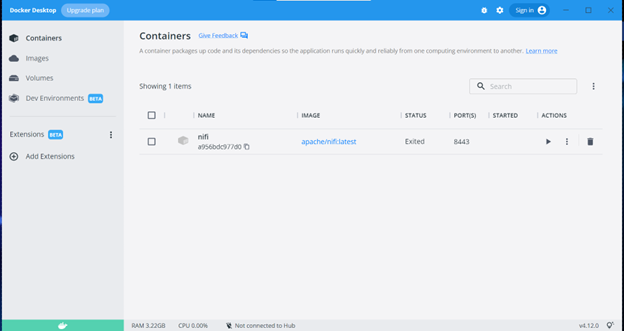
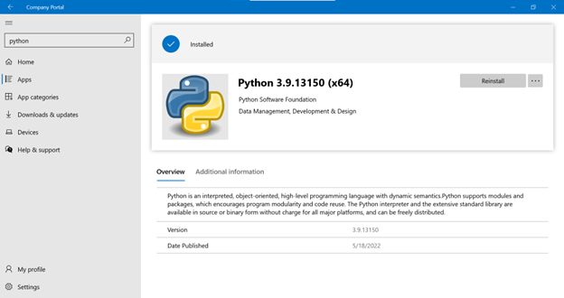
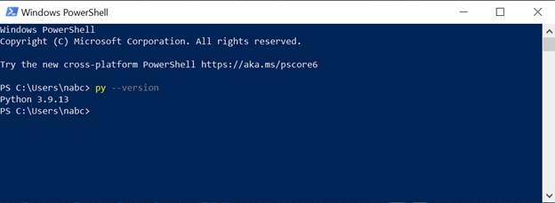
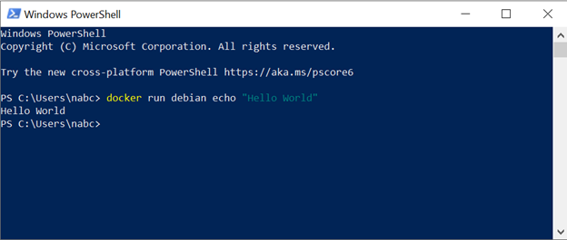
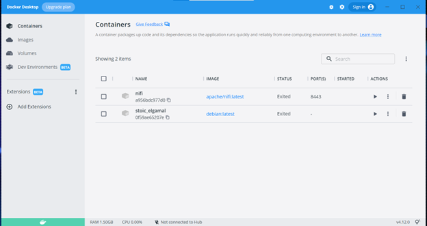

# RETO 1 - Instalar docker y python

## Instalación de docker

Tras conseguir derechos de administrador en el ordenador a través del ticker de iTop, la instalación de Docker Desktop para Windows se realiza a través del installer descargable en su página web (https://docs.docker.com/desktop/install/windows-install/), vista a continuación.

La correcta instalación de éste se puede ver en la siguiente captura del Docker Desktop.

## Instalación de python

La instaclación de python se puede realizar desde el Company Portal, tal como se muestra a continuación.

Y se puede comprobar la correcta instalación con la instrucción "py --version", que debe devolver la versión de Python instalada, tal como se muestra en la siguiente captura. 

## Lanzar un contenedor de prueba

Para terminar con este reto, se lanza un contenedor de prueba con la instrucción "docker run debian echo "Hello World"" que lanza un contenedor a partir de la imagen "debian" y lanza dentro de él la instrucción "echo "Hello World"". El resultado de la ejecución en la consola, así como el contenedor creado visto en Docker Desktop, se ve en las capturas a continuación.

