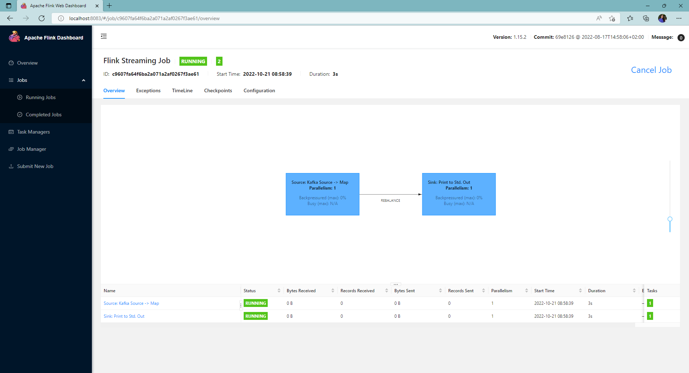

# RETO 11 - NiFi y Kafka y Flink Job

En este reto se pide leer los mensajes del topic "simpsons-quotes" de Kafka, procesarlos en tiempo real mediante un job de Flink y mostrarlos en la terminal.

## 1 - Lanzar Flink con docker-compose

Para este reto, se partió del archivo [docker-compose.yml](docker-compose.yml) de retos anteriores, añadiendo las siguientes líneas para lanzar Flink:

```yaml
  jobmanager:
    image: flink:latest
    ports:
      - "8083:8081"
    command: jobmanager
    environment:
      - |
        FLINK_PROPERTIES=
        jobmanager.rpc.address: jobmanager        
    volumes:
      - ./flink:/opt/flink/apps

  taskmanager:
    image: flink:latest
    depends_on:
      - jobmanager
    command: taskmanager
    scale: 1
    environment:
      - |
        FLINK_PROPERTIES=
        jobmanager.rpc.address: jobmanager
        taskmanager.numberOfTaskSlots: 2  
```

Como se puede ver, se lanzan dos contenedores a partir de la imagen [flink:latest](https://registry.hub.docker.com/_/flink):

- **jobmanager**: contenedor que lanza el "jobmanager" de Flink. Expone su puerto 8081, mapeándolo al 8083 de la máquina local. Además, se crea un volumen que mapea el directorio "flink" local con el directorio "/opt/flink/apps" del contenedor, creado para facilitar la copia de jars de aplicaciones con jobs en el caso de que se quieran lanzar desde la cosola de Flink, aunque, en el caso de este reto, como se verá más adelante, se lanzaron desde la interfaz web.
- **taskmanager**: contenedor que lanza el "taskmanager" de Flink. Depende del contenedor "jobmanager".

Una vez definidos en el fichero docker-compose.yml, los contenedores se lanzar con la siguiente instrucción (desde el directorio en el que se encuentre el fichero):

```
docker-compose up -d
```

Tras ello, se podrán ver los contenedores creados en Docker Desktop:


Y se podrá acceder a la interfaz de Flink en http://localhost:8083:


## 1 - Aplicación Java con Maven ReadKafka

Para implementar la solución al reto, se creó una aplicación Java con Maven usando el IDE [IntelliJ IDEA](https://www.jetbrains.com/idea/download/?ij80pr#section=windows), la aplicación [reto11](./reto11).

Para su correcto funcionamiento, se incluyeron las siguientes dependencias en el archivo [pom.xml](./reto11/pom.xml), teniendo en cuenta las versiones de Scala y de Flink del contenedor (en este caso 2.12 y 1.15.2, respectivamente):

```xml
...
    <dependencies>
        <dependency>
            <groupId>org.apache.flink</groupId>
            <artifactId>flink-core</artifactId>
            <version>1.15.1</version>
        </dependency>
        <dependency>
            <groupId>org.apache.flink</groupId>
            <artifactId>flink-connector-kafka_2.12</artifactId>
            <version>1.14.6</version>
        </dependency>
        <!-- https://mvnrepository.com/artifact/org.apache.flink/flink-streaming-java -->
        <dependency>
            <groupId>org.apache.flink</groupId>
            <artifactId>flink-streaming-java_2.12</artifactId>
            <version>1.14.6</version>
            <scope>compile</scope>
        </dependency>
        <dependency>
            <groupId>org.slf4j</groupId>
            <artifactId>slf4j-api</artifactId>
            <version>2.0.3</version>
        </dependency>
        <dependency>
            <groupId>org.slf4j</groupId>
            <artifactId>slf4j-simple</artifactId>
            <version>2.0.3</version>
        </dependency>
    </dependencies>
...
```

Una vez definidas las dependencias, la aplicación está compuesta por la clase Java [ReadKafka.java](./reto11/src/main/java/org/example/ReadKafka.java) con el siguiente contenido:

```java
package org.example;
import org.apache.flink.api.common.eventtime.WatermarkStrategy;
import org.apache.flink.api.common.functions.MapFunction;
import org.apache.flink.connector.kafka.source.KafkaSource;
import org.apache.flink.connector.kafka.source.enumerator.initializer.OffsetsInitializer;
import org.apache.flink.connector.kafka.source.reader.deserializer.KafkaRecordDeserializationSchema;
import org.apache.flink.streaming.api.datastream.DataStreamSource;
import org.apache.flink.streaming.api.environment.StreamExecutionEnvironment;
import org.apache.kafka.common.serialization.StringDeserializer;

public class ReadKafka {
    public static void main(String[] args) throws Exception {
        StreamExecutionEnvironment env = StreamExecutionEnvironment.getExecutionEnvironment();

        KafkaSource<String> source = KafkaSource
                .<String>builder()
                .setBootstrapServers("docker_test-kafka-1:29092")
                .setTopics("simpsons-quotes")
                .setDeserializer(KafkaRecordDeserializationSchema.valueOnly(StringDeserializer.class))
                .setStartingOffsets(OffsetsInitializer.earliest())
                .build();

        DataStreamSource<String> messageStream = env.fromSource(source, WatermarkStrategy.noWatermarks(), "Kafka Source");

        messageStream.map((MapFunction<String, String>) value -> "Message: " + value).rebalance().print();

        env.execute();
    }
}
```

En este código, se establece una fuente de datos de Kafka, KafkaSource, indicando el broker y el nombre del topic del que se va a leer y que se empezará a leer desde el primer mensaje (earliest offset). 

Después, se lee del KafkaSource utilizando un StreamExecutionEnvironment y se guarda en el DataStreamSource messageStream, cuyo contenido se muestra en consola.

Por último, se ejecuta el StreamExecutionEnvironment.

## 2 - Creación del jar de ReadKafka

Para crear el jar de la aplicación en IntelliJ IDEA se realizan los siguientes pasos:

### 1) File -> Project Structure...


### 2) Artifacts -> JAR -> From modules with dependencies...


### 3) Escoger "ReadKafka" como Main Class -> OK


### 4) Build -> Build Artifacts...


### 5) reto11:jar -> Build


Una vez creado, el jar está disponible en el directorio [/reto11/out/artifacts/reto11_jar](./reto11/out/artifacts/reto11_jar).

## 3 - Ejecución del job desde Flink

Tras generar el jar de la aplicación, es posible ejecutar el job de Flink mediante los siguientes pasos:

### 1) Submit New Job -> + Add New


### 2) Escoger reto11.jar


### 3) Submit



## 4 - Resultado

Una vez lanzado el job de Flink, será posible ver los mensajes en los logs del contenedor del taskmanager:


