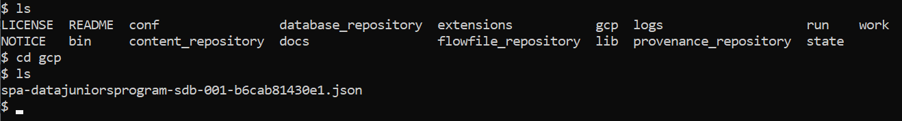

# RETO 13 - NiFi y Pub/Sub y DataFlow y BigQuery

En este reto se pide leer los mensajes del topic "nabc_simpsons-quotes" de Pub/Sub, procesarlos en tiempo real mediante un job de Dataflow ejecutado con un runner de Apache Beam y almacenarlos en una tabla de BigQuery.

Después, se pide, como ejercico extra, reutilizar el pipeline del [reto 3](../RETO%203), almacenando, en este caso, el csv en un bucket de Cloud Storage y creando un job de Dataflow que lo escriba en una tabla de BigQuery.

Por último, se realizó un último ejercicio extra que implementaba el [reto 12](../RETO%2012/README.md), en el que se pedía filtrar los mensajes por los personajes Homer Simpson, Nelson Muntz y Troy McClure e incorporando la fecha de procesamiento, con las tecnologías de cloud.

## Pub/Sub, Datafow y BigQuery

### 1 - Creación del topic y suscripción en Pub/Sub

En primer lugar, se creó el topic 'nabc_simpsons-quotes' de Pub/Sub en el que se almacenarían los mensajes del API de los Simpsons:


Además, para poder leer mensajes de ese topic desde el job de Dataflow, se creo una suscripción con el nombre 'nabc_sub':


### 2 - Creación de la tabla de BigQuery

Tras crear el topic y la suscripción, se creó la tabla 'nabc-simpsons' de BigQuery donde se almacenaría la información de los mensajes:


### 3 - Creación del bucket de Cloud Storage

Para la ejecución del job, será necesario indicar un bucket para staging y otro para temp, por lo que se creó un bucket llamado 'nabc-bucket' con 2 directorios, staging y temp:


### 4 - Pipeline de NiFi

Una vez creados el topic y la tabla, se creó un pipeline de NiFi para escribir mensajes en el topic de Pub/Sub:

Para ello, los procesadores necesarios son:

1. **GetHTTP:** realiza las peticiones a la API cada 5 seg. Se le indica la URL y el nombre del fichero, "quotes".


2. **SplitJson:** extrae el objeto JSON dentro del array JSON que devuelve la petición a la API.


3. **PublishGCPubSub:** manda el contenido del FlowFile de entrada a Pub/Sub. Se le indica el Project ID, los servicios Proxy Configuration Service y GCP Credential Provider Service y el nombre del topic, "nabc_simpsons-quotes" en este caso.


En cuanto a los servicios, en el GCP Credential Provider Service se indicó, en la propiedad Service Account JSON File, la ruta al fichero JSON con la clave para la service account, que se habrá tenido que copiar al contenedor de nifi con la siguiente instrucción (desde el directorio donde esté el fichero):

```
docker cp [nombre_fichero_json] [nombre_contenedor_nifi]:[directorio_contenedor_nifi]
```

Tras lo cual se podrá ver el fichero dentro del contenedor:



E indicar la ruta en las propiedades del servicio:


Por otro lado, en el servicio Proxy Configuration Service se indicó que el Proxy Type es "DIRECT":


Por último, para poder lanzar el procesador PublishGCPubSub, es necesario habilitas los dos servicios creados:


Y el pipeline completo es el siguiente:


### 5 - Código con Apache Beam

Para lanzar el job de Dataflow se utilizó el SDK de Apache Beam para Python, el cual se puede instalar con la siguiente instrucción, que también instala los paquetes extra para el Google Cloud Platform:

```
py -m pip install 'apache-beam[gcp]'
``` 

Una vez instalado Apache Beam, se escribió la siguiente [aplicación de python](pubsub_bigquery_pipeline.py):

```python
import argparse
import time
import logging
import json
import typing
from datetime import datetime
import apache_beam as beam
from apache_beam.io import fileio
from apache_beam.options.pipeline_options import GoogleCloudOptions
from apache_beam.options.pipeline_options import PipelineOptions
from apache_beam.options.pipeline_options import StandardOptions
from apache_beam.transforms.trigger import AfterWatermark, AfterCount, AfterProcessingTime
from apache_beam.transforms.trigger import AccumulationMode
from apache_beam.transforms.combiners import CountCombineFn
from apache_beam.runners import DataflowRunner, DirectRunner

# ### functions and classes

#Map PubSub
def read_message(message):

    pubsubmessage = message.data.decode('utf-8')

    logging.info("Receiving message from PubSub:%s", message)

    row = json.loads(pubsubmessage)

    return row

# ### main

def run():
    # Command line arguments
    parser = argparse.ArgumentParser(description='Load from Json from Pub/Sub into BigQuery')

    # Google Cloud options
    parser.add_argument('--project',required=True, help='Specify Google Cloud project')
    parser.add_argument('--region', required=True, help='Specify Google Cloud region')
    parser.add_argument('--staging_location',default='gs://nabc-bucket/staging/', help='Specify Cloud Storage bucket for staging')
    parser.add_argument('--temp_location', default='gs://nabc-bucket/temp/', help='Specify Cloud Storage bucket for temp')
    parser.add_argument('--runner', required=True, help='Specify Apache Beam Runner')

    # Pipeline-specific options
    parser.add_argument('--table_name', required=True, help='Output BQ table')
    parser.add_argument('--subscription', required=True, help='Input Pub/Sub topic')

    opts, pipeline_opts = parser.parse_known_args()

    # Setting up the Beam pipeline options
    options = PipelineOptions(pipeline_opts, save_main_session=True, streaming=True)
    options.view_as(GoogleCloudOptions).project = opts.project
    options.view_as(GoogleCloudOptions).region = opts.region
    options.view_as(GoogleCloudOptions).staging_location = opts.staging_location
    options.view_as(GoogleCloudOptions).temp_location = opts.temp_location
    options.view_as(GoogleCloudOptions).job_name = 'nabc-streaming-job'
    options.view_as(StandardOptions).runner = opts.runner

    input_subscription = opts.subscription
    table_name = opts.table_name

    # Table schema for BigQuery
    table_schema = {
        "fields": [
            {
                "name": "quote",
                "type": "STRING"
            },
            {
                "name": "character",
                "type": "STRING"
            },
            {
                "name": "image",
                "type": "STRING"
            },
            {
                "name": "characterDirection",
                "type": "STRING"
            }
        ]
    }

    # Create the pipeline
    p = beam.Pipeline(options=options)


    rows = (p | 'ReadFromPubSub' >> beam.io.ReadFromPubSub(subscription=input_subscription,with_attributes=True)
              | beam.Map(read_message))

    (rows   | 'WriteAggToBQ' >> beam.io.WriteToBigQuery(
            table_name,
            schema=table_schema,
            create_disposition=beam.io.BigQueryDisposition.CREATE_IF_NEEDED,
            write_disposition=beam.io.BigQueryDisposition.WRITE_APPEND
            )
    )

    logging.getLogger().setLevel(logging.INFO)
    logging.info("Building pipeline ...")

    p.run().wait_until_finish()

if __name__ == '__main__':
  run()
```

### 6 - Ejecución del job

Antes de ejecutar el job, es necesario poner en marcha el pipeline de NiFi para añadir mensajes al topic de Pub/Sub:


Una vez hecho eso, se puede poner el job en marcha con la siguiente instrucción:

```
py -m pubsub_bigquery_pipeline --runner DataflowRunner --table_name spa-datajuniorsprogram-sdb-001:data_juniors.nabc-simpsons --subscription projects/spa-datajuniorsprogram-sdb-001/subscriptions/nabc_sub --project spa-datajuniorsprogram-sdb-001 --region europe-southwest1 --service-account-email gft-data-sa@spa-datajuniorsprogram-sdb-001.iam.gserviceaccount.com
```

En esta se indica por medio de flags la siguiente información:
- **table_name**: nombre de la tabla de BigQuery, con el formato ```<project>:<dataset>.<table_name>```
- **subscription**: nombre de la suscripción de PubSub, con el formato ```projects/<project>/subscriptions/<subscription>```
- **project**: proyecto de Google Cloud
- **region**: región de Google Cloud
- **service-account-email**: email del service account

Cabe destacar que, para que la ejecución funcione, se ha de establecer la variable de entorno GOOGLE_APPLICATION_CREDENTIALS con la ruta al fichero JSON con la clave para la service account:


Una vez lanzado, se podrá ver el job creado, 'nabc-streaming-job', en Dataflow:


Y los datos de los mensajes en la tabla de BigQuery:


##  EXTRA 1: NiFi, Datafow y BigQuery

### 1 - Tabla de BigQuery

Para este ejercico extra, se utilizó también la tabla 'nabc-simpsons' de BigQuery, donde se almacenará la información leída del fichero CSV:


### 2 - Pipeline de NiFi

En este caso, se partió del pipeline del [reto 3](../RETO%203/README.md), modificando el procesador UpdateAttribute y cambiando el procesador PutFile por uno PutGCSObject para escribir el fichero a un bucket de Cloud Storage en vez de en el contenedor:


Los cambios realizados se muestran a continuación:

- **UpdateAttribute:** añade el atributo "gsc.bucket" con el nombre del bucket, 'nabc-bucket', como valor.


- **PutGCSObject:** escribe el fichero en el bucket indicado en la propiedad 'Bucket'. Es necesario también indicar el ID del proyecto de GCP y el GCP Credentials Provider Service.


En el GCP Credential Provider Service se indicó, en la propiedad Service Account JSON File, la ruta al fichero JSON con la clave para la service account, que se habrá tenido que copiar al contenedor de nifi con la siguiente instrucción (desde el directorio donde esté el fichero):

```
docker cp [nombre_fichero_json] [nombre_contenedor_nifi]:[directorio_contenedor_nifi]
```

Tras lo cual se podrá ver el fichero dentro del contenedor:


E indicar la ruta en las propiedades del servicio:


### 3 - Ejecución del pipeline

Una vez ejecutado el pipeline, se podrá ver el fichero CSV, 'quotes.csv', en el bucket:


Con el siguiente contenido:


### 4 - Código con Apache Beam

Para lanzar el job de Dataflow, se escribió la siguiente [aplicación de python](bucket_bigquery_pipeline.py):

```python
import argparse
import time
import logging
import json
import typing
from datetime import datetime
import apache_beam as beam
from apache_beam.io import fileio
from apache_beam.options.pipeline_options import GoogleCloudOptions
from apache_beam.options.pipeline_options import PipelineOptions
from apache_beam.options.pipeline_options import StandardOptions
from apache_beam.transforms.trigger import AfterWatermark, AfterCount, AfterProcessingTime
from apache_beam.transforms.trigger import AccumulationMode
from apache_beam.transforms.combiners import CountCombineFn
from apache_beam.runners import DataflowRunner, DirectRunner

# ### functions and classes

class Message(typing.Dict):
    quote: str
    character: str
    image: str
    characterDirection: str

beam.coders.registry.register_coder(Message, beam.coders.RowCoder)

class ConvertCsvToMessage(beam.DoFn):

    def process(self, line):
        fields = 'quote,character,image,characterDirection'.split(',')
        values = line.split(',')
        row = dict(zip(fields,values))

        yield Message(**row)

# ### main

def run():
    # Command line arguments
    parser = argparse.ArgumentParser(description='Load from Json from Pub/Sub into BigQuery')

    # Google Cloud options
    parser.add_argument('--project',required=True, help='Specify Google Cloud project')
    parser.add_argument('--region', required=True, help='Specify Google Cloud region')
    parser.add_argument('--staging_location',default='gs://nabc-bucket/staging/', help='Specify Cloud Storage bucket for staging')
    parser.add_argument('--temp_location', default='gs://nabc-bucket/temp/', help='Specify Cloud Storage bucket for temp')
    parser.add_argument('--runner', required=True, help='Specify Apache Beam Runner')

    # Pipeline-specific options
    parser.add_argument('--table_name', required=True, help='Output BQ table')
    parser.add_argument('--input_file', required=True, help='Input file')

    opts, pipeline_opts = parser.parse_known_args()

    # Setting up the Beam pipeline options
    options = PipelineOptions(pipeline_opts, save_main_session=True)
    options.view_as(GoogleCloudOptions).project = opts.project
    options.view_as(GoogleCloudOptions).region = opts.region
    options.view_as(GoogleCloudOptions).staging_location = opts.staging_location
    options.view_as(GoogleCloudOptions).temp_location = opts.temp_location
    options.view_as(GoogleCloudOptions).job_name = 'nabc-batch-job'
    options.view_as(StandardOptions).runner = opts.runner

    input_file = opts.input_file
    table_name = opts.table_name

    # Table schema for BigQuery
    table_schema = {
        "fields": [
            {
                "name": "quote",
                "type": "STRING"
            },
            {
                "name": "character",
                "type": "STRING"
            },
            {
                "name": "image",
                "type": "STRING"
            },
            {
                "name": "characterDirection",
                "type": "STRING"
            }
        ]
    }

    # Create the pipeline
    p = beam.Pipeline(options=options)


    rows = (p | 'ReadFromCSVFile' >> beam.io.ReadFromText(input_file,skip_header_lines=1)
              | "ParseCSV" >> beam.ParDo(ConvertCsvToMessage()))

    (rows   | 'WriteAggToBQ' >> beam.io.WriteToBigQuery(
            table_name,
            schema=table_schema,
            create_disposition=beam.io.BigQueryDisposition.CREATE_IF_NEEDED,
            write_disposition=beam.io.BigQueryDisposition.WRITE_APPEND
            )
    )

    logging.getLogger().setLevel(logging.INFO)
    logging.info("Building pipeline ...")

    p.run().wait_until_finish()

if __name__ == '__main__':
  run()

```

### 5 - Ejecución del job

Se puede poner el job en marcha con la siguiente instrucción:

```
py -m pubsub_bigquery_pipeline --runner DataflowRunner --table_name spa-datajuniorsprogram-sdb-001:data_juniors.nabc-simpsons --input_file gs://nabc-bucket/quotes.csv --project spa-datajuniorsprogram-sdb-001 --region europe-southwest1 --service-account-email gft-data-sa@spa-datajuniorsprogram-sdb-001.iam.gserviceaccount.com
```

En esta se indica por medio de flags la siguiente información:
- **table_name**: nombre de la tabla de BigQuery, con el formato ```<project>:<dataset>.<table_name>```
- **input_file**: ruta al fichero CSV en el bucket
- **project**: proyecto de Google Cloud
- **region**: región de Google Cloud
- **service-account-email**: email del service account

Cabe destacar que, para que la ejecución funcione, se ha de establecer la variable de entorno GOOGLE_APPLICATION_CREDENTIALS con la ruta al fichero JSON con la clave para la service account:


Una vez lanzado, se podrá ver el job creado, 'nabc-streaming-job', en Dataflow:


Y, tras la compleción del job, los datos de los mensajes en la tabla de BigQuery:


##  EXTRA 2: Reto 12 en cloud

### 1 - Tabla de BigQuery

Para este segundo ejercico extra, se utilizó la tabla 'nabc-simpsons-timestamp' de BigQuery, donde se almacenará, además de la información leída del fichero CSV, el valor de timestamp de la fecha de procesado del mensaje:


### 2 - Pipeline de NiFi

En este caso, se utilizó el mismo pipeline utilizado para el enunciado principal de este reto: 


### 4 - Código con Apache Beam

Para lanzar el job de Dataflow, se escribió la siguiente [aplicación de python](pubsub_bigquery_filter_pipeline.py):

```python
import argparse
import time
import logging
import json
import typing
from datetime import datetime
import apache_beam as beam
from apache_beam.io import fileio
from apache_beam.options.pipeline_options import GoogleCloudOptions
from apache_beam.options.pipeline_options import PipelineOptions
from apache_beam.options.pipeline_options import StandardOptions
from apache_beam.transforms.trigger import AfterWatermark, AfterCount, AfterProcessingTime
from apache_beam.transforms.trigger import AccumulationMode
from apache_beam.transforms.combiners import CountCombineFn
from apache_beam.runners import DataflowRunner, DirectRunner

# ### functions and classes

#Map PubSub
def read_message(message):

    pubsubmessage = message.data.decode('utf-8')

    logging.info("Receiving message from PubSub:%s", message)

    row = json.loads(pubsubmessage)

    return row

def is_character(quote):
  return quote['character'] == 'Homer Simpson' or  quote['character'] == 'Nelson Muntz' or  quote['character'] == 'Troy McClure'

class AddTimestamp(beam.DoFn):
  def process(self, message):
    message_with_timestamp = "{\"timestamp\": \""+datetime.now().strftime("%Y-%m-%d %H:%M:%S")+"\", \"quote\": \""+message['quote']+"\", \"character\": \""+message['character']+"\", \"image\": \""+message['image']+"\", \"characterDirection\": \""+message['characterDirection']+"\"}"
    row = json.loads(message_with_timestamp)
    yield row

# ### main

def run():
    # Command line arguments
    parser = argparse.ArgumentParser(description='Load from Json from Pub/Sub into BigQuery')

    # Google Cloud options
    parser.add_argument('--project',required=True, help='Specify Google Cloud project')
    parser.add_argument('--region', required=True, help='Specify Google Cloud region')
    parser.add_argument('--staging_location',default='gs://nabc-bucket/staging/', help='Specify Cloud Storage bucket for staging')
    parser.add_argument('--temp_location', default='gs://nabc-bucket/temp/', help='Specify Cloud Storage bucket for temp')
    parser.add_argument('--runner', required=True, help='Specify Apache Beam Runner')

    # Pipeline-specific options
    parser.add_argument('--table_name', required=True, help='Output BQ table')
    parser.add_argument('--subscription', required=True, help='Input Pub/Sub topic')

    opts, pipeline_opts = parser.parse_known_args()

    # Setting up the Beam pipeline options
    options = PipelineOptions(pipeline_opts, save_main_session=True, streaming=True)
    options.view_as(GoogleCloudOptions).project = opts.project
    options.view_as(GoogleCloudOptions).region = opts.region
    options.view_as(GoogleCloudOptions).staging_location = opts.staging_location
    options.view_as(GoogleCloudOptions).temp_location = opts.temp_location
    options.view_as(GoogleCloudOptions).job_name = 'nabc-streaming-job-timestamp'
    options.view_as(StandardOptions).runner = opts.runner

    input_subscription = opts.subscription
    table_name = opts.table_name

    # Table schema for BigQuery
    table_schema = {
        "fields": [
            {
                "name": "timestamp",
                "type": "TIMESTAMP"
            },
            {
                "name": "quote",
                "type": "STRING"
            },
            {
                "name": "character",
                "type": "STRING"
            },
            {
                "name": "image",
                "type": "STRING"
            },
            {
                "name": "characterDirection",
                "type": "STRING"
            }
        ]
    }

    # Create the pipeline
    p = beam.Pipeline(options=options)


    rows = (p | 'ReadFromPubSub' >> beam.io.ReadFromPubSub(subscription=input_subscription,with_attributes=True)
              | beam.Map(read_message)
              | 'Filter by character' >> beam.Filter(is_character)
              | 'Add timestamp' >> beam.ParDo(AddTimestamp()))

    (rows   | 'WriteAggToBQ' >> beam.io.WriteToBigQuery(
            table_name,
            schema=table_schema,
            create_disposition=beam.io.BigQueryDisposition.CREATE_IF_NEEDED,
            write_disposition=beam.io.BigQueryDisposition.WRITE_APPEND
            )
    )

    logging.getLogger().setLevel(logging.INFO)
    logging.info("Building pipeline ...")

    p.run().wait_until_finish()

if __name__ == '__main__':
  run()

```

### 5 - Ejecución del job

Se puede poner el job en marcha con la siguiente instrucción:

```
py -m pubsub_bigquery_filter_pipeline --runner DataflowRunner --table_name spa-datajuniorsprogram-sdb-001:data_juniors.nabc-simpsons-timestamp --subscription projects/spa-datajuniorsprogram-sdb-001/subscriptions/nabc_sub --project spa-datajuniorsprogram-sdb-001 --region europe-southwest1 --service-account-email gft-data-sa@spa-datajuniorsprogram-sdb-001.iam.gserviceaccount.com
```

Una vez lanzado, se podrá ver el job creado, 'nabc-streaming-job-timestamp', en Dataflow:


Y, tras la compleción del job, los datos de los mensajes en la tabla de BigQuery:


