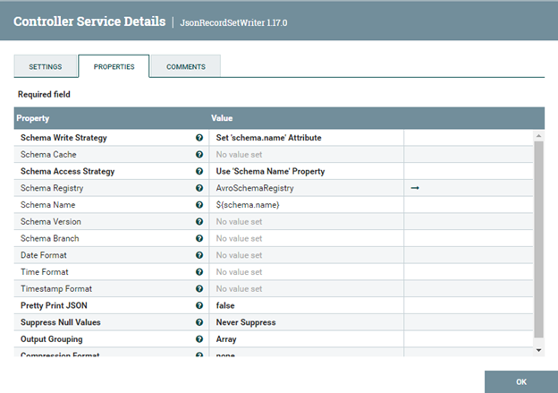

# RETO 2 - Levantar NiFi

## Levantar Apache NiFi con docker

Para levantar Apache NiFi con docker se puede usar la siguiente instrucción:

docker run --name nifi -p 8443:8443 -e SINGLE_USER_CREDENTIALS_USERNAME=admin -d -e SINGLE_USER_CREDENTIALS_PASSWORD=password1234 apache/nifi:latest

En ésta, se lanza un contenedor de nombre "nifi" a partir de la imagen apache/nifi:latest cuyo puerto 8443 se mapea al 8443 de la máquina local. Además, se definen las variables de entorno para usuario y contraseña con tal de poder hacer LOG IN en NiFi una vez lanzado.

Una vez ejecutada la instrucción, se puede ver el contenedor en Docker Desktop:


Tras esperar unos segundos, es posible acceder a NiFi en https://localhost:8443/nifi, y, tras introducir usuario y contraseña, entrar a su interfaz de usuario, tal como se ve en las siguientes capturas:


## Pipeline que lea de un fichero y lo escriba en otro

En primer lugar, para que NiFi pueda leer el fichero CSV, es necesario copiarlo al contenedor. Se va a copiar a un directorio de nombre "input_files", creado con la instrucción "mkdir input_files" dentro del directorio /home/nifi del contenedor. Además, se crea otro directorio con el nombre "output_files" donde se escribirá el fichero JSON resultante. Ambos se puden ver creados dentro del contenedor en la siguiente imagen.


Después, la copia del fichero al directorio input_files se realiza con la siguiente instrucción (desde el directorio donde está el fichero):

```
docker cp ./netflix.csv nifi:/home/nifi/input_files 
```

El fichero aparecerá ahora dentro del directorio input_files, tal como se ve en la captura a continuación.


Una vez copiado el fichero CSV al contenedor, ya se puede montar en NiFi el pipeline que lo leerá, lo convertirá a formato JSON, filtrará el contenido para que solo se escriban aquellas películas para mayores de 14 (rating igual a "TV-14") y lo escribirá en un fichero JSON.

Los procesadores necesarios son:

1. **GetFile:** lee el fichero CSV. Se le indica que el directorio en el que está es "/home/nifi/input_files" y se indica con el File Filter que su nombre debe ser "netflix.csv".


2. **UpdateAttribute:** para añadir un atributo que indique el nombre del schema, en este caso "netflix".


3. **ConvertRecord:** convierte el CSV a JSON, utilizando un servicio CSVReader, que a su vez usará otro servicio, AvroSchemeRegistry, y un servicio JsonRecordSetWriter. 




Es necesario que todos estos servicios estén habilitados o "enabled", tal como se ve a continuación.


4. **SplitJson:** divide el FlowFile con el array JSON, creando 1 FlowFile por cada objeto dentro del array.


5. **EvaluateJsonPath:** añade a cada FlowFile un atributo con el valor del rating.


6. **RouteOnAttribute:** dará como salida aquellos FlowFiles cuyo atributo "rating" sea igual a "TV-14".


7. **MergeContent:** vuelve a juntar los FlowFiles con los objetos JSON en un solo FlowFile con un solo  JSON array como contenido.


8. **UpdateAttribute:** cambia el atributo "filename" para añadirle la extensión de un archivo JSON.


9. **PutFile:** escribe en el directorio /home/nifi/output_file el fichero resultante "netflix.csv.json".


Por lo tanto, para terminar, el pipeline completo es el siguiente:


Y el fichero resultante:

