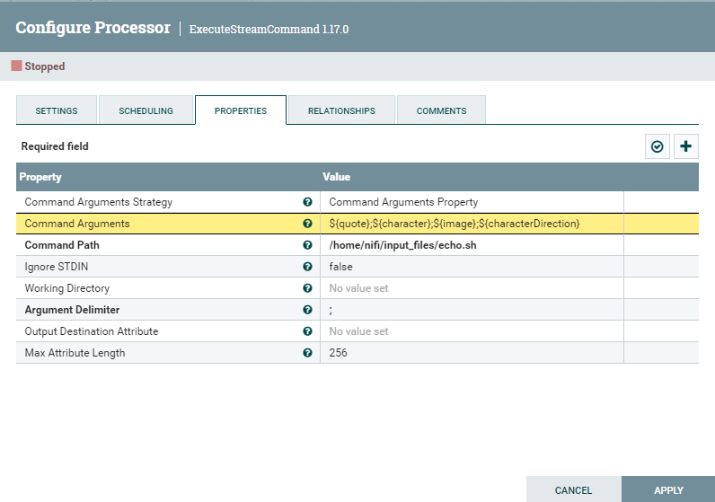

# RETO 3 - NiFi + API

En este reto, se pedía lanzar peticiones cada 30 seg a la siguiente API: https://thesimpsonsquoteapi.glitch.me/quotes. Después, pedía convertir la respuesta JSON a formato CSV y concatenarla en un fichero CSV de salida.

Se han planteado dos soluciones distintas: una primera que concatena las respuestas a las peticiones cada 30 seg a un fichero CSV previamente creado y una segunda que se espera a tener un número concreto de respuestas (en este caso 3) para después juntarlas con un procesador MergeContent y escribirlas en un fichero de salida. Ambas se presentan a continuación.

## Pipeline que lance peticiones a la API cada 30 seg y concatene a un fichero CSV

Para la primera solución se necesitan los siguientes procesadores:

1. **GetHTTP:** realiza las peticiones a la API cada 30 seg. Se le indica la URL y el nombre del fichero, "quotes".

2. **SplitJson:** extrae el objeto JSON dentro del array JSON que devuelve la petición a la API.

3. **EvaluateJsonPath:** añade al FlowFile un atributo para cada par clave-valor del JSON.

4. **ExecuteStreamCommand:** ejecuta el script bash que concatena en el fichero CSV la nueva línea. Para ello, se crea primero un fichero CSV al que se le añade la primera línea de cabeceras, llamado en este caso "quotes-script.csv". 

Además, se debe crear un script con permiso de ejecución, en este caso llamado "echo.sh", al cual se le pasarán los atributos con los valores del JSON como argumentos y los escribirá en el fichero separados por comas.

La configuración de este procesador es la siguiente:

Y este es el fichero resultante:

## Pipeline que lance peticiones a la API cada 30 seg, las junte con MergeContent y las escriba en un fichero CSV

Para esta segunda solución, los procesadores necesarios (algunos de ellos coinciden con la anterior) son:

1. **GetHTTP:** realiza las peticiones a la API cada 30 seg. Se le indica la URL y el nombre del fichero, "quotes".

2. **SplitJson:** extrae el objeto JSON dentro del array JSON que devuelve la petición a la API.

3. **EvaluateJsonPath:** añade al FlowFile un atributo para cada par clave-valor del JSON.

4. **AttributesToCSV:** cambia el contenido del FlowFile por un listado del valor de los atributos añadidos en el paso anterior en formato CSV.

5. **MergeContent:** crea un nuevo FlowFile a partir del contenido de 3 FlowFiles de entrada. Además, añade al principio de éste una línea con las cabeceras "quote,character,image,characterDirection".

6. **UpdateAttribute:** cambia el atributo "filename" para añadirle la extensión de un archivo CSV.

7. **PutFile:** escribe en el directorio /home/nifi/input_files el fichero resultante "quotes.csv".

El fichero resultante es el siguiente:

Para terminar, el pipeline completo (para ambas soluciones) es el siguiente:

