# RETO 4 - NiFi + Kafka

## Levantar docker-compose con kafka, nifi y kafka-ui

El primer paso en este cuarto reto es levantar un docker-compose con kafka, nifi y kafka-ui.

Para ello, el fichero [docker-compose.yml](docker-compose.yml) tiene el siguiente contenido:

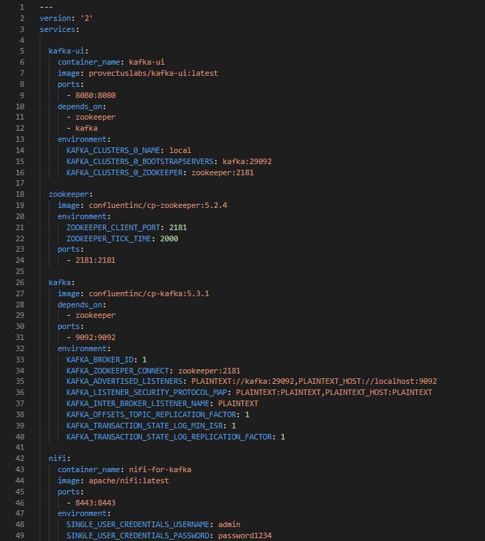

Como se puede observar, se levanta un docker-compose con los siguientes contenedores:
1. **kafka-ui:** contenedor con Kafka-UI a partir de la imagen provectuslabs/kafka-ui:latest, con su puerto 8080 mapeado al 8080 de la máquina local. Depende de los contenedores zookeeper y  kafka.
2. **zookeeper:** contentenedor con ZooKeeper a partir de la imagen confluentinc/cp-zookeeper:5.2.4, necesario para levantar Kafka. Se expone su puerto 2181, mapeándolo al de la máquina local.
3. **kafka:** contenedor con Kafka a partir de la imagen confluentinc/cp-kafka:5.3.1, con su puerto 9092 mapeado al 9092 de la máquina local. Depende del contenedor zookeeper. Cabe destacar las dos variables de entorno KAFKA_TRANSACTION_STATE_LOG_MIN_ISR y  KAFKA_TRANSACTION_STATE_LOG_REPLICATION_FACTOR, que son necesarias con un único broker para que las transacciones de Kafka funcionen correctamente (https://github.com/confluentinc/ksql/issues/4456).
4. **nifi:** contenedor con NiFi a partir de la imagen apache/nifi:latest, cuyo puerto 8443 se mapea al 8443 de la máquina local. Además, se definen las variables de entorno para usuario y contraseña con tal de poder hacer LOG IN en NiFi una vez lanzado. 

Estos cuatro contenedores se levantan con la instrucción "docker-compose up -d" desde el directorio donde se encuentra el fichero YAML:

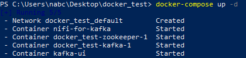

Una vez lanzados, los contenedores se pueden ver en Docker Desktop:

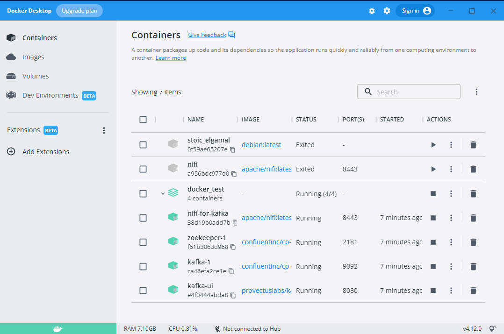

Y se podrá acceder a la interfaz de NiFi en https://localhost:8443/nifi y a la de Kafka-UI en http://localhost:8080/, donde se podrá ver el cluster de nombre "local" creado:

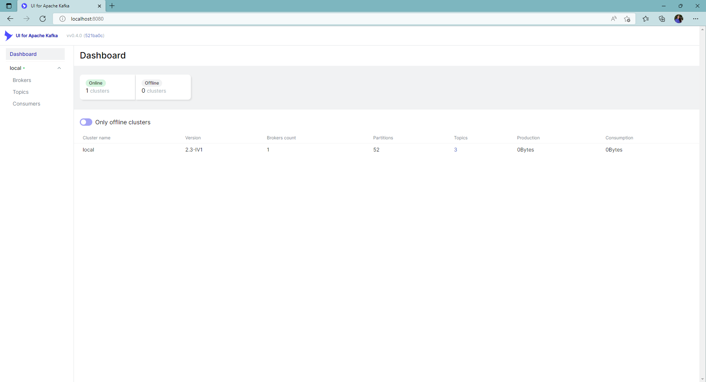

## Topic en Kafka-UI con datos de la API de Simpsons

Una vez levantada la infraestructura con NiFi, Kafka y Kafka-UI, es necesario definir el pipeline en NiFi que lance peticiones a la API de los Simpsons cada 30 segundos y mande mensajes con el contenido de la respuesta a un topic en Kafka de nombre "simpsons-quotes".

Para ello, los procesadores necesarios son:

1. **GetHTTP:** realiza las peticiones a la API cada 30 seg. Se le indica la URL y el nombre del fichero, "quotes".

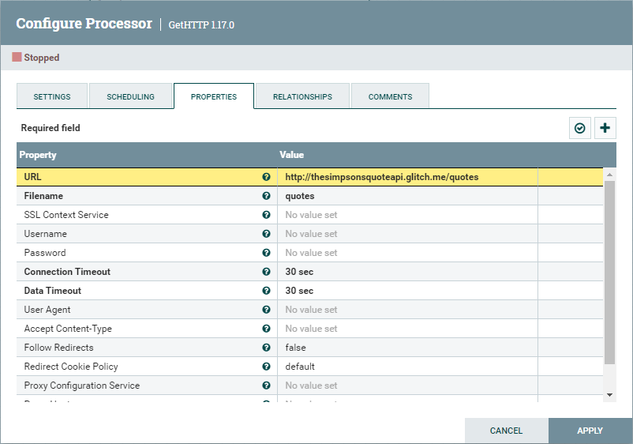
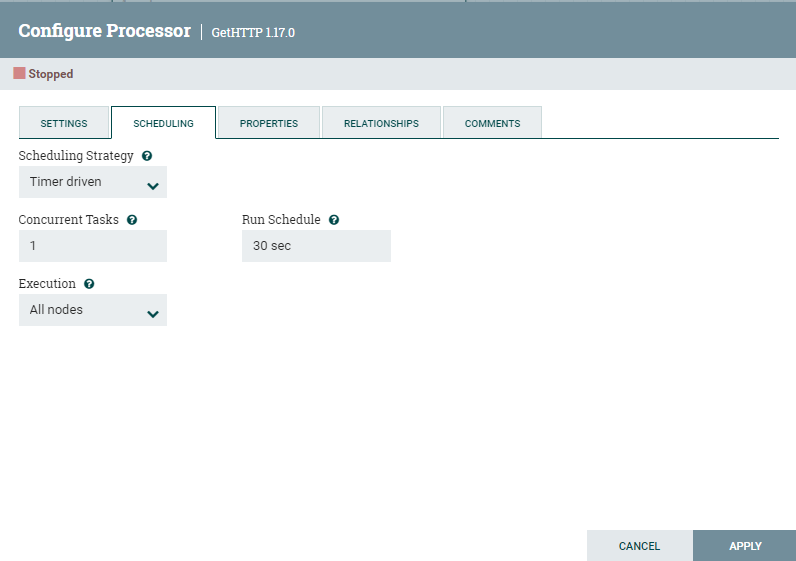

2. **SplitJson:** extrae el objeto JSON dentro del array JSON que devuelve la petición a la API.

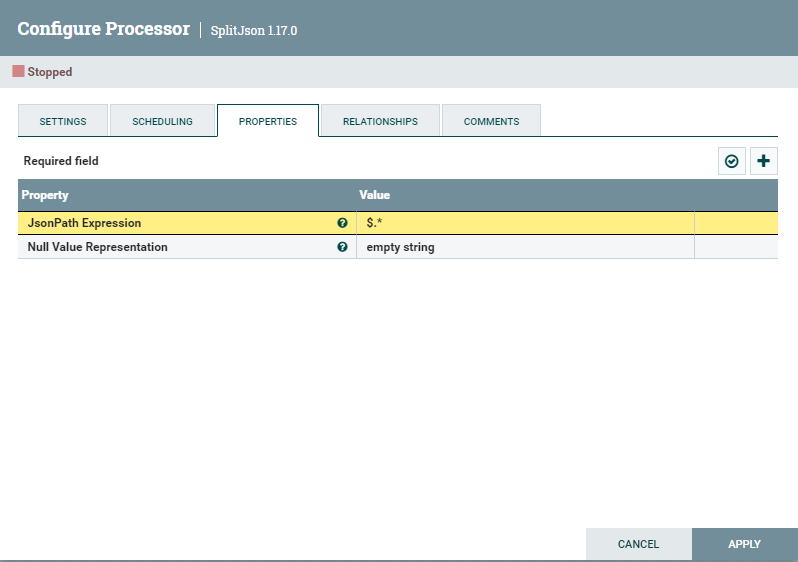

3. **PublishKafka:** manda el contenido del FlowFile de entrada a Apache Kafka. Se le indica el Kafka broker, indicando el nombre de host y el puerto, y el nombre del topic, "simpsons-quotes" en este caso.

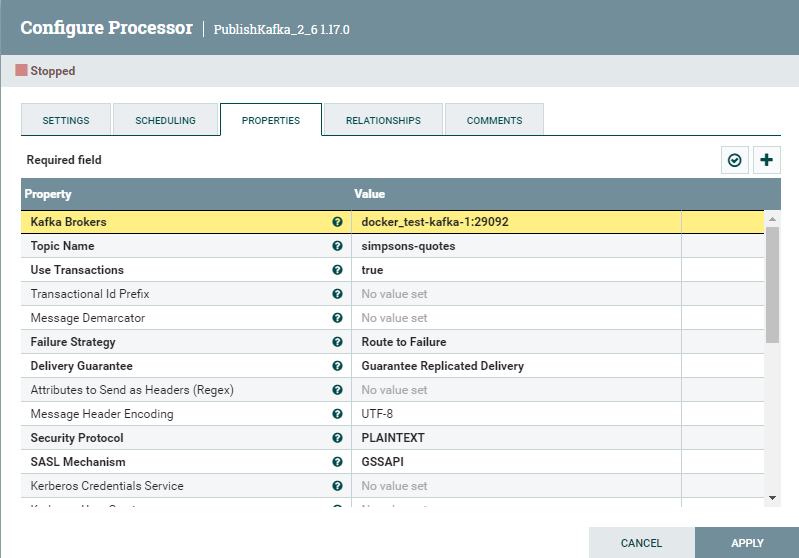

Para averiguar el nombre de host, basta con utilizar la instrucción "docker network ls" para conseguir el nombre de la red y "docker network inspect NOMBRE_RED" para conseguir el nombre de host asignado para el contenedor de kafka:

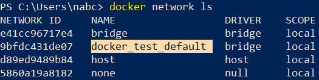
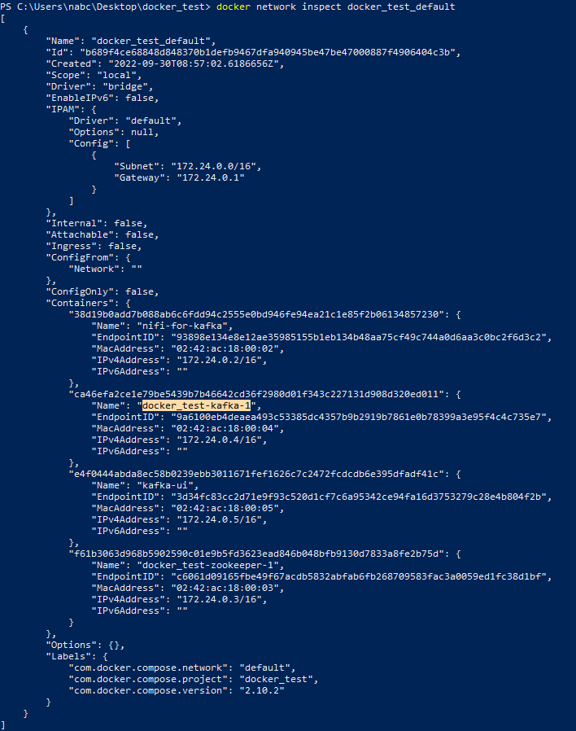

Además, el puerto correcto se puede ver en la variable de entorno KAFKA_ADVERTISED_LISTENERS del contenedor kafka en el fichero docker-compose.yml:

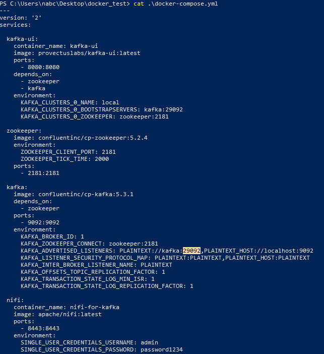

De esta manera, el pipeline completo es el siguiente:

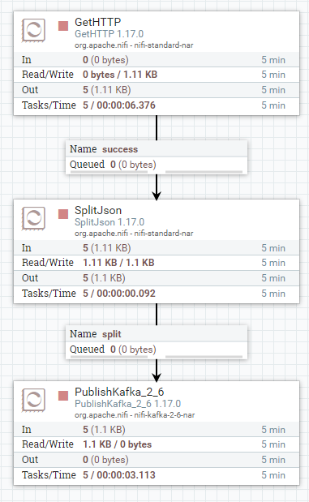

Para terminar, basta con lanzar los procesadores en NiFi y ver como aparecen los mensajes en el topic "simpsons-quotes" en la interfaz de Kafka-UI:

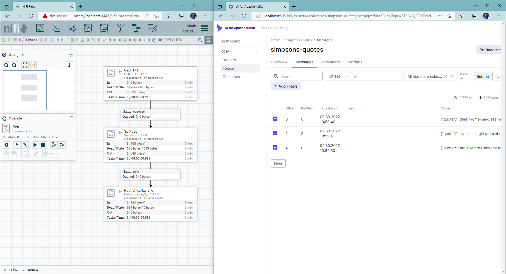
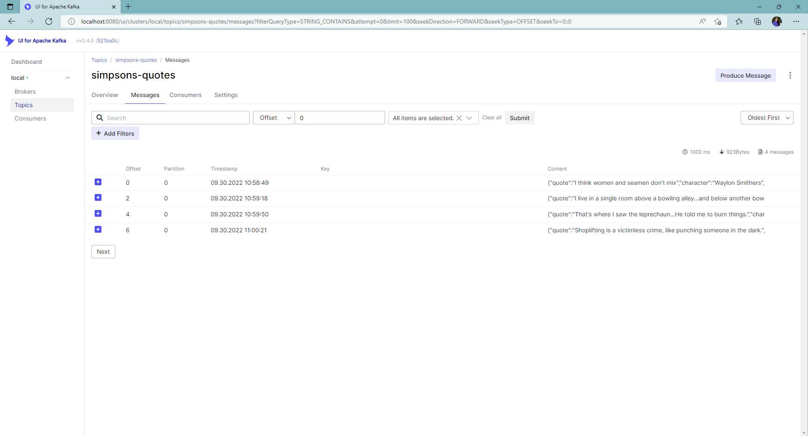