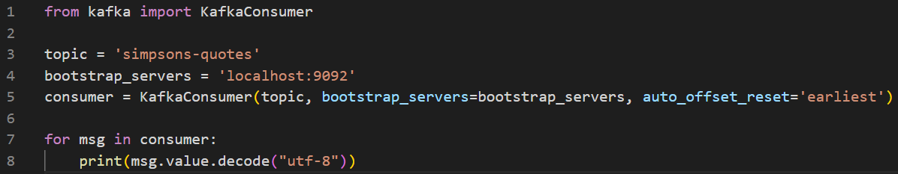

# RETO 5 - NiFi + Kafka + Python

Este quinto reto parte del resultado del [Reto 4](../RETO%204/README.md), que levanta una infraestructura con NiFi, Kafka y Kafka-UI y realiza peticiones a la API de los Simpsons cada 30 segundos, mandando mensajes con el contenido de la respuesta a un topic en Kafka de nombre "simpsons-quotes".

## Script de Python que lee de kafka e imprime por pantalla los mensajes

Para leer los mensajes de la cola "simpsons-quotes" e imprimirlos por pantalla se ha utilizado el paquete kafka-python, que se puede instalar con la instrucción "py -m pip install kafka-python":

Una vez instalado, se utiliza el script [print-kafka.py](print-kafka.py) para imprimir el contenido de los mensajes del topic por pantalla, el cual tiene el siguiente contenido:

Por último, el script se puede lanzar con la instrucción "py ./print-kafka.py" desde el directorio donde se encuentre el fichero, tras lo cual aparecerán por pantalla los mensajes del topic "simpsons-quotes":

## EXTRA: dockerizar script de Python y meterlo como contenedor en el docker-compose

Como paso extra en este reto se pedía dockerizar el script de Python y meterlo como contenedor en el docker-compose previamente utilizado.

Para ello, es necesario, en primer lugar, generar la imagen a partir de la cual se creará el contenedor. Eso mismo se puede hacer con el siguiente archivo [Dockerfile](Dockerfile):

Como se puede observar, la imagen creada partirá de la [imagen oficial python](https://registry.hub.docker.com/_/python). Además, se utilizan las siguientes instrucciones:
1. WORKDIR: indica que las siguientes instrucciones se ejecutarán en el directorio "/usr/src/app"
2. RUN: ejecuta la instrucción "python -m pip install kafka-python" dentro del contenedor
3. CMD: ejecuta la instrucción "python print-kafka.py" una vez se inicie el contenedor.

Tras definir el fichero Dockerfile, se puede crear la imagen, que en este caso se llamará "python-app", con la instrucción "docker build -y python-app ." (desde el directorio donde se encuentre el fichero Dockerfile). Una vez creada, se podrá ver en Docker Desktop:

Después, se puede definir un contenedor a partir de esta en el fichero [docker-compose.yml](docker-compose.yml) utilizado en el reto 4, añadiendo las siguientes líneas:

Como se puede ver, se crea un contenedor a partir de la imagen creada, python-app, que dependerá de kafka y zookeeper. Además, se crea un volumen que mapea el directorio "/usr/src/app" del contenedor con uno llamado "python" en la máquina local, de forma que se pueda copiar ahí el fichero a ejecutar. Por último, se indica que en caso de fallo se reinicie el contenedor, para evitar que se pare al no encontrar el kafka broker inicialmente (es necesario esperar unos segundos). 

De esta manera, antes de lanzar los contenedores con "docker-compose up -d", es necesario copiar el script [print-kafka.py](print-kafka-extra.py) al directorio donde se ha montado el volumen:

Cabe destacar que con tal de que funcione dentro de la infraestructura creada por el docker-compose.yml, se ha cambiado la URL del bootstrap server de 'localhost:9092' a 'docker_test-kafka-1:29092'.

Por lo tanto, para terminar, se lanzan los contenedores con la instrucción "docker-compose up -d":

Y se puede ver el resultado de ejecución del script en los logs del contenedor "docker_test-python-1":

