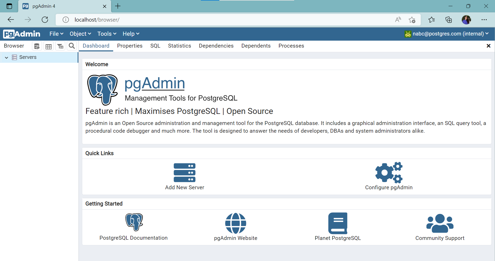
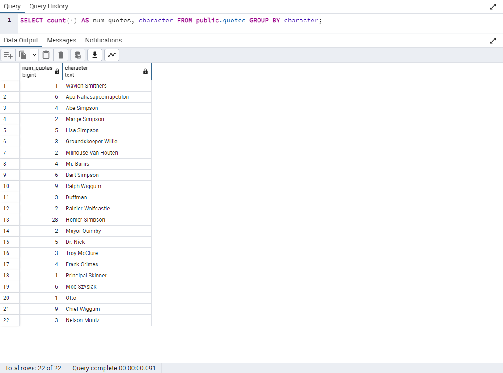

# RETO 6 - NiFi + Kafka + Python + Base de datos

## Levantar base de datos de PostgreSQL

En primer lugar, para realizar este reto se han de añadir al fichero [docker_compose.yml](docker-compose.yml) utilizado en retos anteriores las siguientes líneas:


Estas líneas levantan los siguiente contenedores:

1. **postgres:** contenedor de PostgreSQL. Expone su puerto 5432 y se mapea al mismo de la máquina local. Además se indica, por medio de variables de entorno, la IP del host, el nombre de usuario, la contraseña y el nombre de la base de datos, en este caso "simpsons".

2. **pgadmin:** contenedor de pgadmin para visualizar la base de datos. Depende de postgres y expone su puerto 80 y lo mapea al 80 de la máquina local. Además se define, por medio de variables de entorno, el email y contraseña necesarios para el log in.

Para levantar la infraestructura, se utiliza la instrucción "docker-compose up -d", tras lo cual se podrán ver los contenedores lanzados en Docker Desktop:


Una vez levantada, será posible acceder a pgAdmin en http://localhost:80:



Y se podrá conectar al contenedor "postgres" por medio de un nuevo servidor, tras lo cual se podrá ver la base de datos "simpsons":


Una vez se tiene acceso a la base de datos de PostgreSQL es posible, desde pgAdmin, crear las tablas para albergar los datos del API. En este caso se han creado dos tablas:

1. **characters:** almacena un id autoincremental, "id", el nombre del personaje, "name", y su imagen, "image".
2. **quotes:** almacena un id autoincremental, "id", una frase, "quote", el nombre del personaje que la dijo, "character", y la dirección en la que mira, "characterDirection".  

## Carga de datos

Tras crear las tablas donde se almacenará la información, se han implementado dos métodos distintos para cargar los datos: un **script de Python** y un **pipeline en NiFi** que consume los mensajes del topic "simpsons-quotes" de Kafka (en el cual se almacenaron los mensajes en el [Reto 4](../RETO%204/README.md)) y los inserta en las tablas por medio de consultas SQL. 

### Script de Python

El script de Python utilizado para la carga de datos tiene el nombre de [insert-postgresql.py](insert-postgresql.py) y el siguiente contenido:


Para poder lanzarlo desde el contenedor de python dentro de la infraestructura, es necesario volver a generar la imagen "pyhton-app" con la instalación de las nuevas librerías necesarias. El fichero [Dockerfile](Dockerfile) para ello es el siguiente:


La nueva imagen se puede generar con la instrucción "docker build -t python-app ." y, una vez generada, se vuelve a lanzar la infraestructura con "docker-compose up -d".

Una vez creado el contenedor de pyhton a partir de la nueva imagen, se copia el nuevo fichero al directorio en el que se montó el volumen del contenedor y se ejecuta el script desde dentro del contenedor con la instrucción:

```
python insert-postgresql.py
```

Una vez ejecutado, se pueden ver las tablas pobladas de datos en pgAdmin:


### Pipeline en NiFi

Para ello, los procesadores necesarios son los siguientes:

1. **ConsumeKafka:** crea un consumer para Kafka, indicando, entre otras cosas, el host y puerto del kafka broker, "docker_test-kafka-1:29092", el topic del cuál se consumirán mensajes, "simpsons-quotes", y el group id, "nifi-consumer".


Una vez lanzado, se podrá ver el consumer en Kafka-UI:


2. **JoltTransformJson:** transforman el objeto JSON del contenido del mensaje a otro con el formato necesario para cada tabla. 


3. **ConvertJSONToSQL:** generan una consulta SQL de inserción a partir del objeto JSON de entrada, indicando el JDBC connection pool, el tipo de consulta, "INSERT", y el nombre de la tabla en cada caso, "characters" y "quotes".


En cuanto al connection pool, es necesario crearñlo, configurarlo y activarlo, indicando la URL de conexión a la base de datos, en la cual habrá que usar como nombre de host el que se ha dado al contenedor dentro del network lanzado con el docker-compose, el nombre de la clase del driver y su localización:


Para que esto funcione, habrá que descargar el driver en el contenedor de nifi con la instrucción "docker exec -it NOMBRE_CONTENEDOR_NIFI curl https://jdbc.postgresql.org/download/postgresql-42.2.23.jar --output /opt/nifi/nifi-current/lib/postrgesql-42.2.23.jar":


Tras lo cual se podrá ver en el sistema de ficheros del contenedor de NiFi:


4. **PutSQL:** realiza la consulta creada con el procesador ConvertJSONToSQL. En el caso de la tabla "quotes" fue necesario reescribir la consulta para entrecomillar algunos nombres de columna que daban problemas.


Ese es el pipeline resultante:


Una vez pusto en marcha, se pueden ver las tablas pobladas de datos en pgAdmin:


## Consulta SQL: número de mensajes por cada personaje

Para terminar, la consulta SQL para obtener el número de mensajes por cada personaje es la siguiente:

```
SELECT count(*) AS num_quotes, character FROM public.quotes GROUP BY character;
```

Y este es el resultado:

