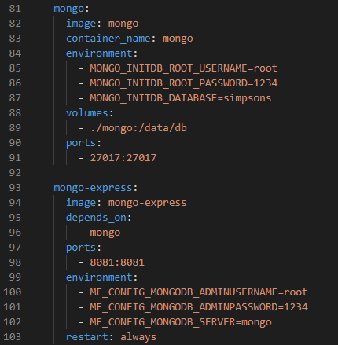
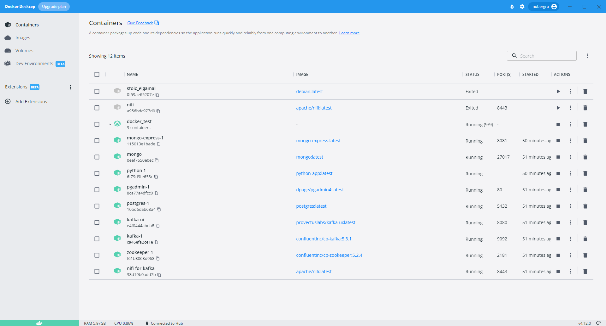
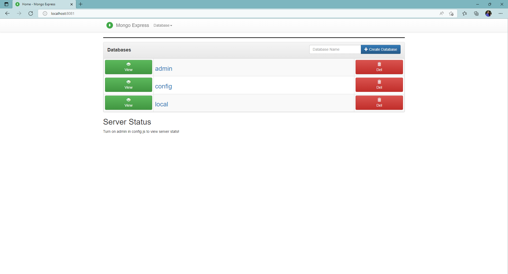
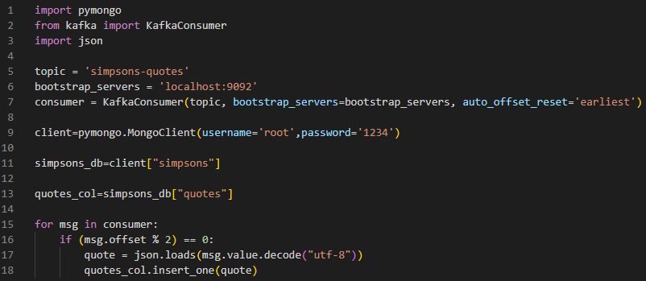
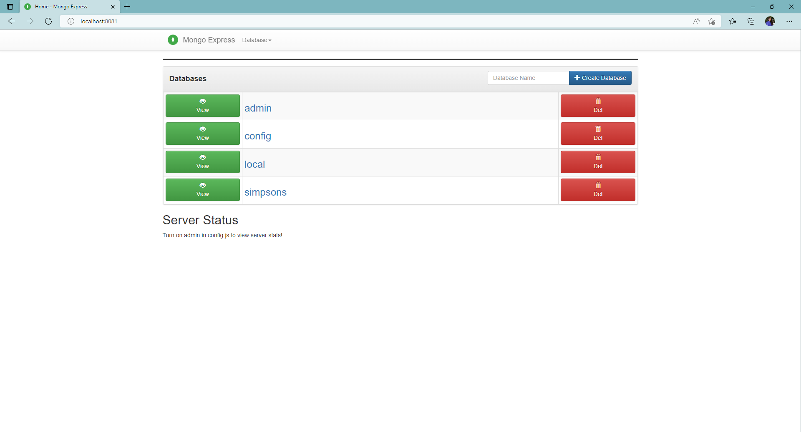
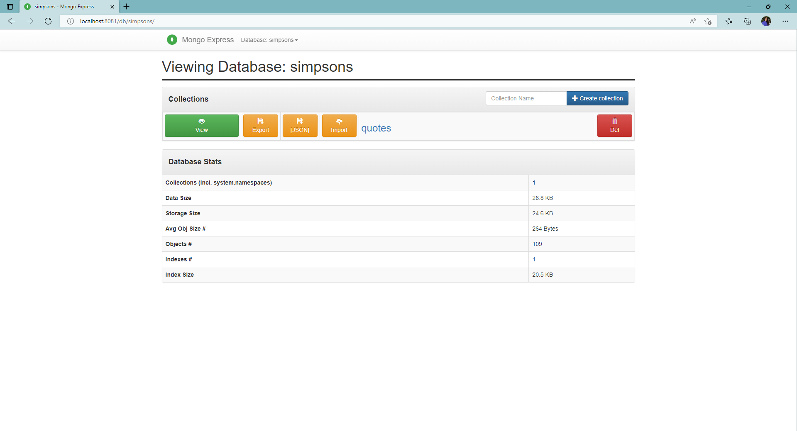
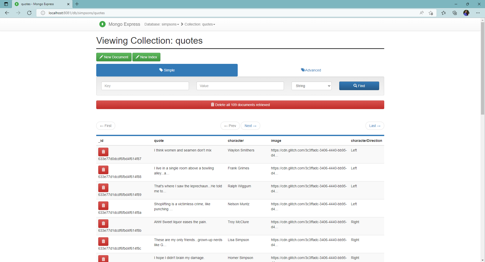
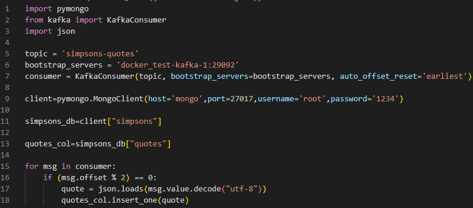

# RETO 7 - NiFi + Kafka + Python + Base de datos NoSQL

## Levantar base de datos de MongoDB

En primer lugar, para realizar este reto se han de añadir al fichero [docker_compose.yml](docker-compose.yml) utilizado en retos anteriores las siguientes líneas:



Estas líneas levantan los siguiente contenedores:

1. **mongo:** contenedor de MongoDB. Expone su puerto 27017 y lo mapea al mismo de la máquina local. Además se indica, por medio de variables de entorno, el nombre de usuario, la contraseña y el nombre de la base de datos, en este caso "simpsons".

2. **mongo-express:** contenedor de Mongo Express para visualizar la base de datos de MongoDB. Depende del contenedor mongo y expone su puerto 8081 y lo mapea al 8081 de la máquina local. También se define, por medio de variables de entorno, el usuario, la contraseña y el servidor de MongoDB, que en este caso será el contenedor de nombre "mongo". Por último, se indica que se reinicie simpre para que no se caiga en los primeros segundos en los que mongo está arrancando.

Una vez más, para levantar la infraestructura, se utiliza la instrucción "docker-compose up -d", tras lo cual se podrán ver los contenedores lanzados en Docker Desktop:



Una vez levantada, será posible acceder a Mongo Express en http://localhost:8081:



## Carga de datos con script de Python

Se han realizado dos versiones del script de Python: una para ejecutarlo en local y otra para ejecutarlo desde el contenedor con Python.

### Script local

El script de Python utilizado para la carga de datos desde local tiene el nombre de [insert-mongodb.py](./local/insert-mongodb.py) y el siguiente contenido:



Como se puede ver, en este se consumen mensajes del topic de Kafka llamado "simpsons", tal como se hacía en el script [print-kafka.py](../RETO%205/print-kafka.py) del reto 5. Además, se crea un cliente de Mongo indicando el usuario y la contraseña y se define la base de datos, "simpsons", y colección, "quotes", donde se insertarán los datos de los mensajes conforme se vayan consumiendo en el bucle.

Antes de ejecutar el script, será necesario instalar el paquete "pymongo":

```
py -m pip install pymongo
```

Tras lo cual se podrá lanzar con la siguiente instrucción:

```
py insert-mongodb.py
```

Una vez ejecutado el script, será posible ver tanto la base de datos creada como su colección y los mensajes guardados en ella en la interfaz de Mongo Express:





### Script en el contenedor

En el caso de la ejecución desde el contenedor de Python, el script [insert-mongodb.py](./docker/insert-mongodb.py) se ha modificado de la siguiente manera, cambiando los nombres de host y puertos de kafka broker y mongo client por aquellos que les corresponde en la insfraestructura levantada por docker-compose:



Tras modificarlo, se copia el nuevo fichero al directorio en el que se montó el volumen del contenedor y se ejecutan, dentro del contenedor, las instrucciones necesarias para instalar el paquete pymongo y ejecutar el script:

```
py -m pip install pymongo
```

```
py insert-mongodb.py
```
Una vez ejecutado el script, será posible ver tanto la base de datos creada como su colección y los mensajes guardados en ella en la interfaz de Mongo Express:


