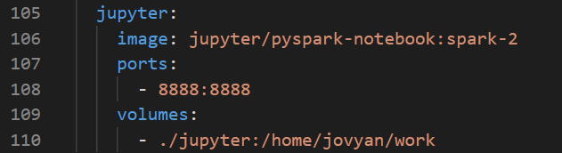
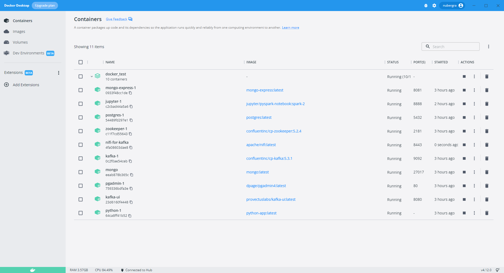
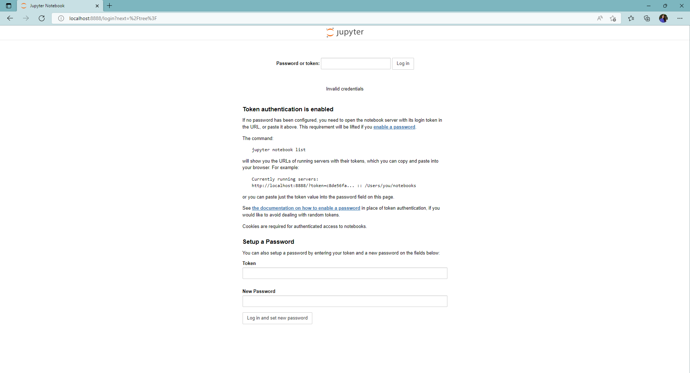
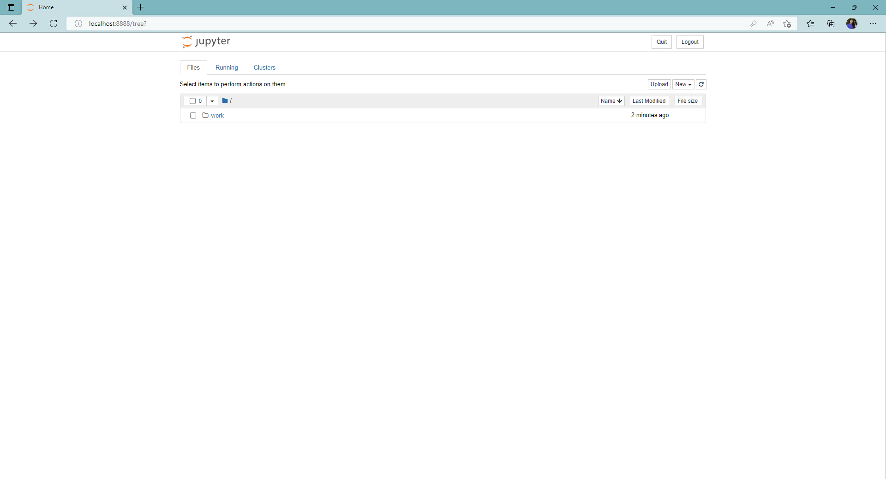
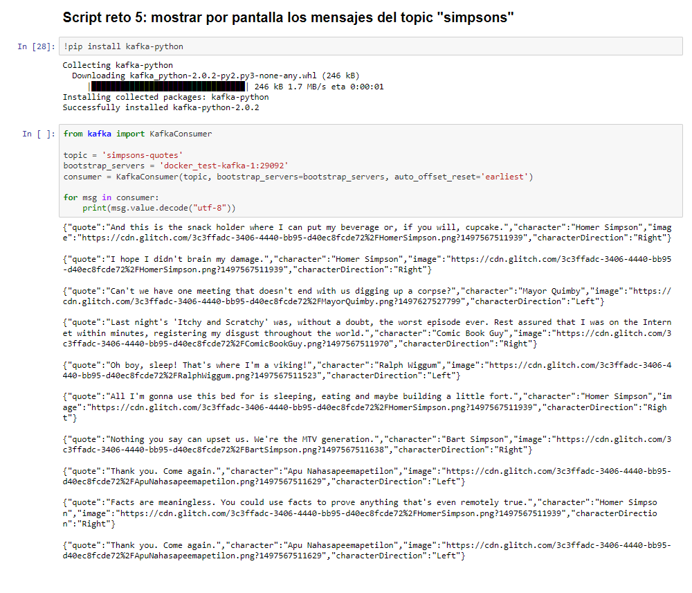
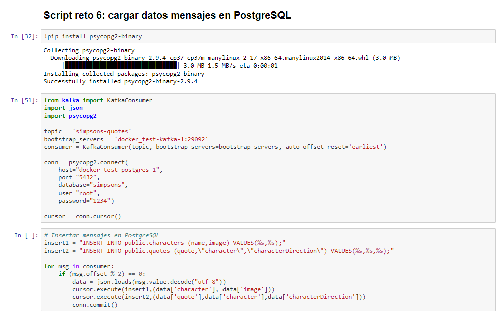
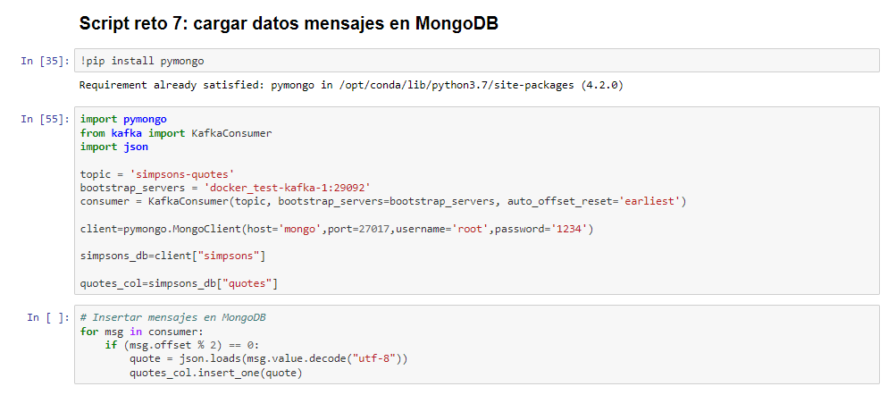
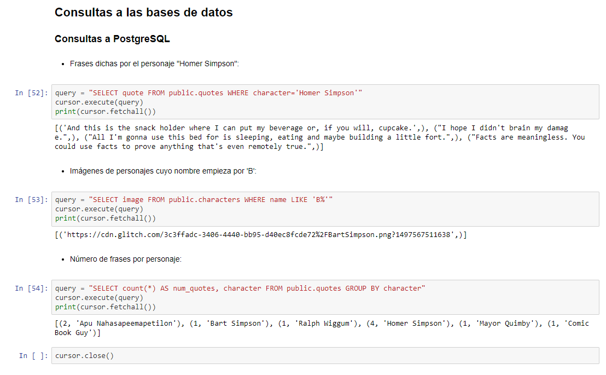
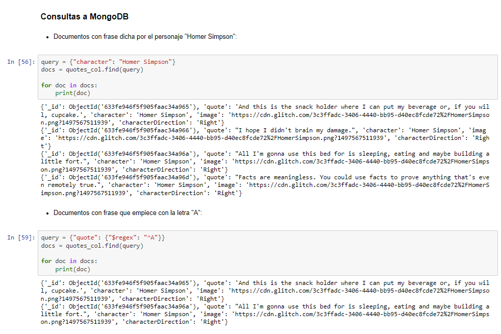

# RETO 8 - NiFi + Kafka + Python Notebook + BD

## Levantar contenedor con Jupyter

En primer lugar, para realizar este reto se han de añadir al fichero [docker_compose.yml](docker-compose.yml) utilizado en retos anteriores las siguientes líneas:

Estas líneas levantan el contenedor **jupyter** a partir de la imagen jupyter/pyspark-notebook:spark-2, que contiene tanto Jupyter Notebook como PySpark. Se expone su puerto 8888 y lo mapea al mismo de la máquina local. Además, se monta un volumen que mapea el directorio local "jupyter" con el "/home/jovyan/work" del contenedor.

Una vez más, para levantar la infraestructura, se utiliza la instrucción "docker-compose up -d", tras lo cual se podrán ver los contenedores lanzados en Docker Desktop:

Una vez levantada, será posible acceder a Jupyter en http://localhost:8888 y se podrá realizar el log in con el token de acceso indicado en los logs del contenedor:

## Notebook de Jupyter

Para resolver este reto, se ha creado un Notebook de nombre [Reto 8](Reto%208.ipynb), en el cuál se ha incluido lo siguiente:

### Script reto 5: mostrar por pantalla los mensajes del topic "simpsons"

Para poder ejecutar el script del Reto 5, [print-kafka.py](../RETO%205/print-kafka-extra.py), primero se ejecuta un cell con la instrucción "!pip install kafka-pyhton" y luego otra con el contenido del script.

### Script reto 6: cargar datos mensajes en PostgreSQL

Para poder ejecutar el script del Reto 6, [insert-postgresql.py](../RETO%206/insert-postgresql.py), primero se ejecuta un cell con la instrucción "!pip install psycopg2-binary" y luego dos más con el contenido del script: una primera con la definición del consumer y de la conexión con la base de datos y otra con los inserts a las tablas. Esto se ha hecho así para el caso en el que ya se hayan insertado los datos pero se quiera definir la conexión y el cursor para poder realizar las consultas a la base de datos mostradas más adelante.

### Script reto 7: cargar datos mensajes en MongoDB

Para poder ejecutar el script del Reto 7, [insert-mongodb.py](../RETO%207/docker/insert-mongodb.py), primero se ejecuta un cell con la instrucción "!pip install pymongo" y luego dos más con el contenido del script: una primera con la definición del consumer y de la conexión con la base de datos y otra con los inserts a la colección. Esto se ha hecho así para el caso en el que ya se hayan insertado los datos pero se quiera definir la conexión para poder realizar las consultas a la base de datos mostradas más adelante.

### Consultas a las bases de datos

#### Consultas a PostgreSQL

#### Consutlas a MongoDB

