# NiFi y Kafka y PySpark Notebook y BD

Para este reto, se ha utilizado la misma infraestructura lanzada en el [Reto 8](../RETO%208/docker-compose.yml), que incluía un contenedor a partir de la imagen **jupyter/pyspark-notebook:spark-2**, que contiene tanto Jupyter Notebook como PySpark.

Una vez lanzado, se ha preparado el notebook [Reto 9.ipynb](Reto%209.ipynb) para leer mensajes del topic de kafka 'simpsons-quotes' y escribir aquellas frases dichas por el personaje 'Homer Simpson' en las bases de datos de PostgreSQL y MongoDB.

## 1 - Imports

En primer lugar, es necesario importar la librería de pyspark, así como las clases SparkSession y Row de pyspark.sql y pyspark.sql types y functions:

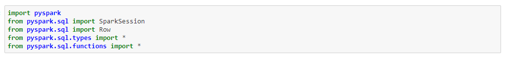

## 2 - Definición de dataframe PostgreSQL

Para poder conectarse con PostgreSQL, es necesario copiar el jar [postgresql-42.2.25.jar](./jars/postgresql/postgresql-42.2.25.jar) al contenedor por medio de la siguiente instrucción:

```
docker cp postgresql/postgresql-42.2.25.jar docker_test-jupyter-1:/usr/local
```

Tras ello, es posible crear una conexión con PostgreSQL con la siguiente SparkSession:

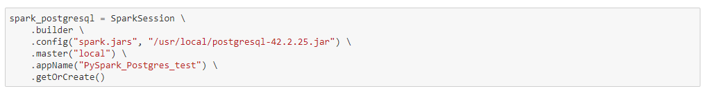

Y un DataFrame para la tabla 'simpsons' en la que se cargarán los mensajes con las siguientes líneas:

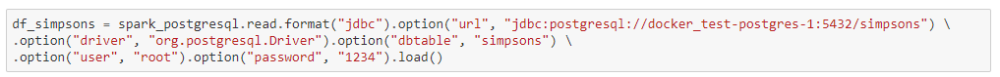

Tras ello, será posible ver la estructura de la tabla, y por lo tanto del dataframe:

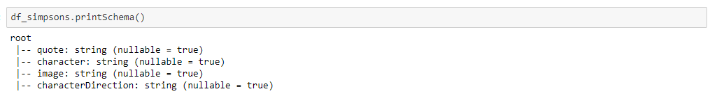

Y el contenido de esta, inicialmente vacía:

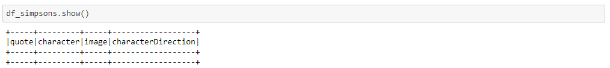

## 3 - Definición de dataframe MongoDB

Para poder conectarse con MongoDB, es necesario copiar los jars incluidos en el directorio [jars/mongodb/](./jars/mongodb/) al contenedor por medio de las siguientes instrucciones:

```
docker cp mongo-spark-connector_2.11-2.4.2.jar docker_test-jupyter-1:/usr/local/spark/jars
```

```
docker cp bson-3.8.1.jar docker_test-jupyter-1:/usr/local/spark/jars
```

```
docker cp mongodb-driver-3.8.1.jar docker_test-jupyter-1:/usr/local/spark/jars
```

```
docker cp mongodb-driver-core-3.8.1.jar docker_test-jupyter-1:/usr/local/spark/jars
```

Tras ello, es posible crear una conexión con MongoDB con la siguiente SparkSession:

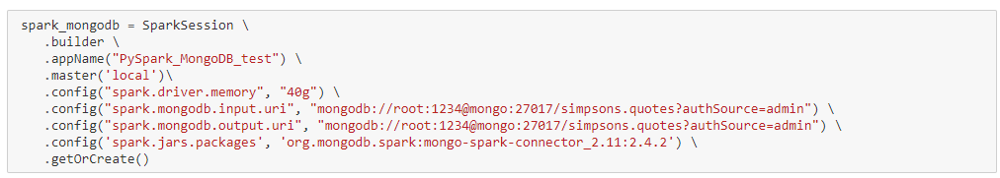

Y un DataFrame para la colección 'quotes' en la que se cargarán los mensajes con las siguientes líneas:

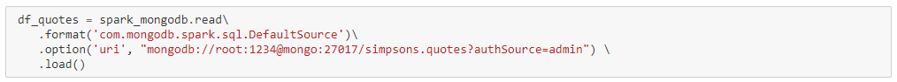

Tras ello, será posible ver el contenido de la colección, inicialmente vacía:

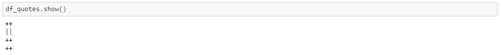

## 4 - Conexión con Kafka y carga de mensajes filtrados en bases de datos

Para poder conectarse con Kafka, es necesario copiar los jars incluidos en el directorio [jars/kafka/](./jars/kafka/) al contenedor por medio de las siguientes instrucciones:

```
docker cp spark-sql-kafka-0-10_2.11-2.4.5.jar docker_test-jupyter-1:/usr/local/spark/jars
```

```
docker cp kafka-clients-2.0.0.jar docker_test-jupyter-1:/usr/local/spark/jars
```

Tras ello, es posible crear una conexión con Kafka con la siguiente SparkSession:

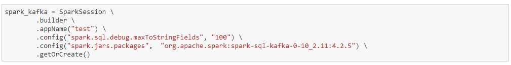

Y un DataFrame para el topic 'simpsons-quotes' con las siguientes líneas:

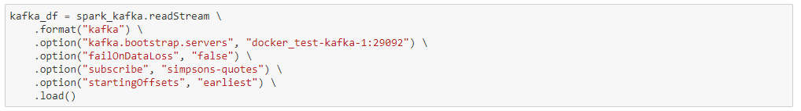

Tras ello, será posible ver el schema del dataframe:

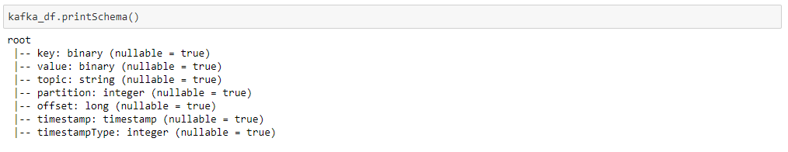

Después, se guarda, en otro dataframe, los valores de 'value' decodificados como strings:

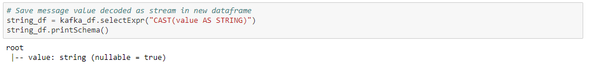

A continuación, se guardan los valores del DataFrame string_df en otro con el schema de la tabla de la Base de Datos:

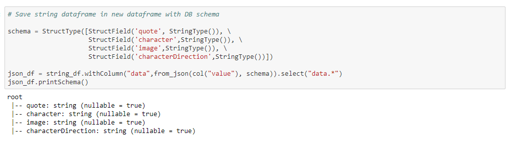

Para terminar, se lee del último DataFrame con las funciones **writeStream** y **start()**, llamando para cada conjunto de mensajes leidos del topic a la función **write_to_postgres_and_mongo**, que los filtrará para recoger solo los del personaje 'Homer Simpson' antes de insertarlos tanto en PostgreSQL como en MongoDB:

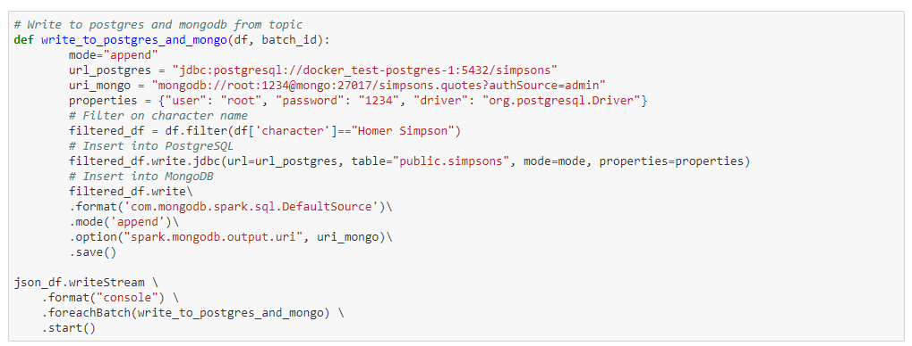

## Resultado

Los datos se podrán ver cargados tanto en la tabla de PostgreSQL como en la colección de MongoDB:

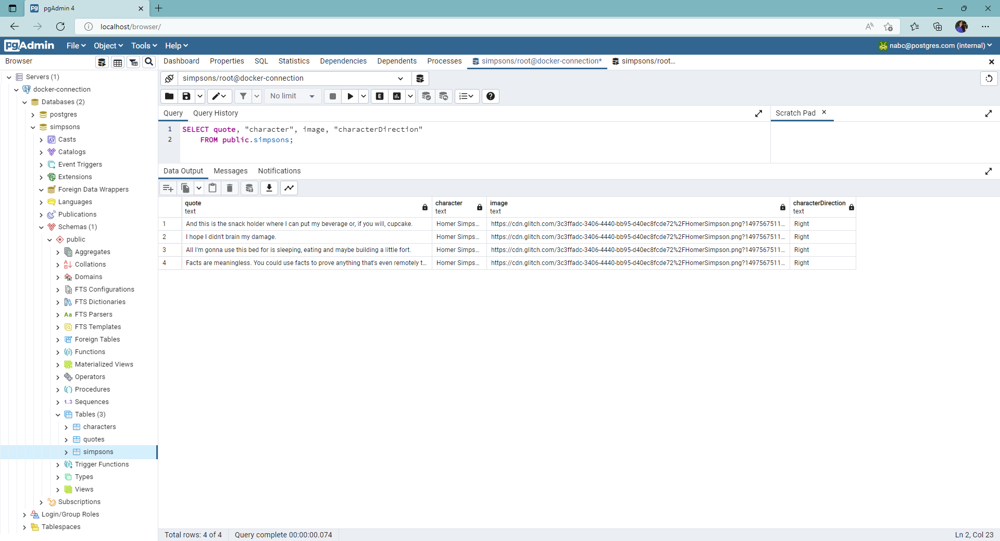
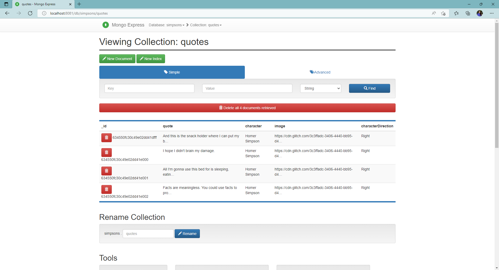
